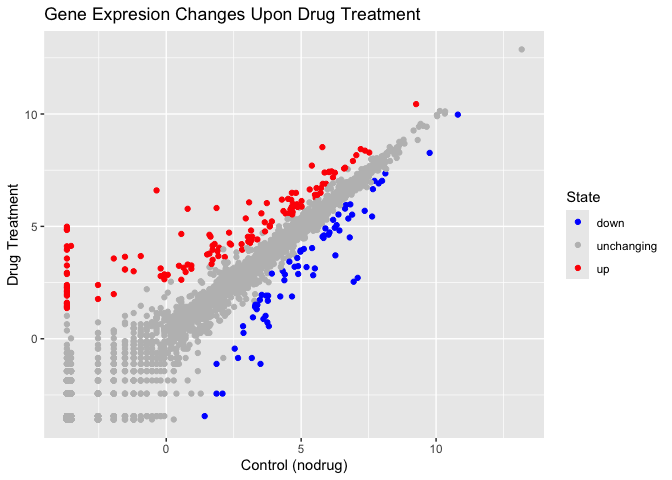
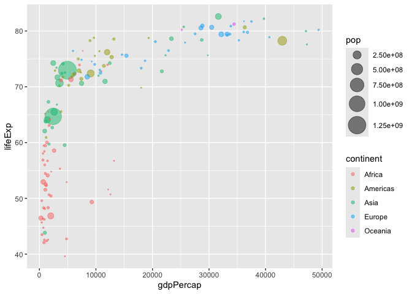
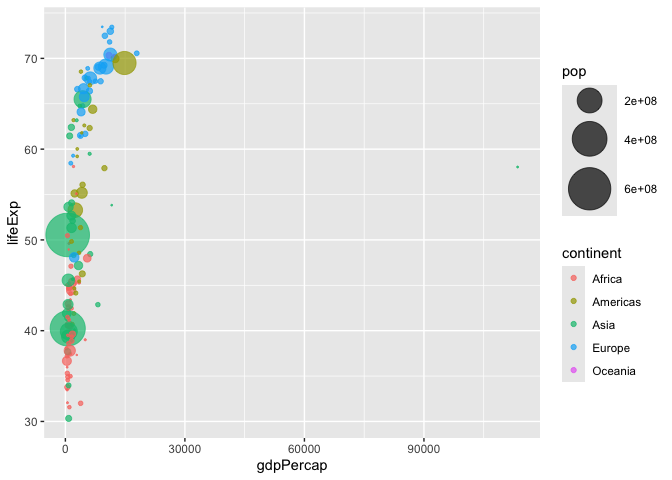
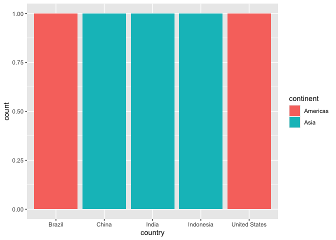

# Class 5 Data Viz with ggplot
Derek (PID: A16942232)

## Plotting in R

R has lots of ways to make plots and figures. This includes so-called
**base** graphics and packages like ***ggplot2***

## Running Code

When you click the **Render** button a document will be generated that
includes both content and the output of embedded code. You can embed
code like this:

``` r
plot(cars)
```


This is a **base** R plot of the in-built `cars` database that has only
two columns:

``` r
head(cars)
```

      speed dist
    1     4    2
    2     4   10
    3     7    4
    4     7   22
    5     8   16
    6     9   10

> Q. How would we plot this dataset with **ggplot2**

All ggplot figures have at least 3 layers:

- **data**
- **aes** (how the data maps to the plot)
- **geoms** (how we draw the data, lines, points, etc)

Before I use any new package I need to download and install it with the
`install.packages()` command.

I never use the `install.packages()`within my quarto document, otherwise
I will reinstall the package over and over.

Once a package is installed I can load it up with the `library()`
function.

``` r
# install.packages("ggplot2)
library("ggplot2")
ggplot(cars) + aes(x = speed, y = dist) + geom_point()
```


Key-point: For simple plots (like the one above) ggplot is more verbose
(we need to do more typing) but as they get more complicated ggplot
starts to be more clear and simple than base R plot.

``` r
ggplot(cars, aes(speed, dist)) + geom_point() + geom_smooth(method = "lm", se = FALSE) + labs(title = "Stopping distance of old cars", subtitle = "From the in-built cars dataset") + theme_bw() 
```

    `geom_smooth()` using formula = 'y ~ x'


``` r
url <- "https://bioboot.github.io/bimm143_S20/class-material/up_down_expression.txt"
genes <- read.delim(url)
head(genes)
```

            Gene Condition1 Condition2      State
    1      A4GNT -3.6808610 -3.4401355 unchanging
    2       AAAS  4.5479580  4.3864126 unchanging
    3      AASDH  3.7190695  3.4787276 unchanging
    4       AATF  5.0784720  5.0151916 unchanging
    5       AATK  0.4711421  0.5598642 unchanging
    6 AB015752.4 -3.6808610 -3.5921390 unchanging

``` r
nrow(genes)
```

    [1] 5196

``` r
colnames(genes)
```

    [1] "Gene"       "Condition1" "Condition2" "State"     

``` r
ncol(genes)
```

    [1] 4

``` r
table(genes$State)
```


          down unchanging         up 
            72       4997        127 

``` r
round(table(genes$State)/nrow(genes)*100,2)
```


          down unchanging         up 
          1.39      96.17       2.44 

The Key functions here were: `nrow()` and `ncol()` `table()` is very
useful for getting counts finally `round()` for rounding.

``` r
p <- ggplot(genes) + 
    aes(x=Condition1, y=Condition2, col = State) +
    geom_point()
p + scale_colour_manual(values = c("blue","gray","red")) + labs(title = "Gene Expresion Changes Upon Drug Treatment", x = "Control (nodrug)", y = "Drug Treatment" )
```



\##Section 7: Going Further

``` r
# File location online
url <- "https://raw.githubusercontent.com/jennybc/gapminder/master/inst/extdata/gapminder.tsv"

gapminder <- read.delim(url)
```

``` r
# install.packages("dplyr")  ## un-comment to install if needed
library(dplyr)
```


    Attaching package: 'dplyr'

    The following objects are masked from 'package:stats':

        filter, lag

    The following objects are masked from 'package:base':

        intersect, setdiff, setequal, union

``` r
gapminder_2007 <- gapminder %>% filter(year==2007)

ggplot(gapminder_2007) + aes(x = gdpPercap, y = lifeExp, size = pop, color = continent) + geom_point(alpha = 0.5) + scale_size_area(max_size = 10)
```



``` r
gapminder_1957 <- gapminder %>% filter(year==1957)
ggplot(gapminder_1957) + aes(gdpPercap,lifeExp, size = pop, color = continent) + geom_point(alpha = 0.7) + scale_size_area(max_size = 15)
```



``` r
gapminder_2007_1957 <- gapminder %>% filter(year == 1957 | year == 2007)
ggplot(gapminder_2007_1957) + aes(gdpPercap, lifeExp, color = continent, size = pop) + geom_point(alpha = 0.7) + scale_size_area(max_size = 10) + facet_wrap(~year)
```


> Q. Extract data for the US in 1992

``` r
filter(gapminder, country =="United States", year ==1992)
```

            country continent year lifeExp       pop gdpPercap
    1 United States  Americas 1992   76.09 256894189  32003.93

What was the population of the US in the last year we have data for?

``` r
filter(gapminder, country == "Spain", year == 2007)
```

      country continent year lifeExp      pop gdpPercap
    1   Spain    Europe 2007  80.941 40448191  28821.06

> Q. What countries in the data set had a population smaller than
> ireland in 2007?

``` r
filter(gapminder, country == "Ireland", year == 2007)
```

      country continent year lifeExp     pop gdpPercap
    1 Ireland    Europe 2007  78.885 4109086     40676

-First limit/subset the dataset to the year 2007

-Then find the `pop` value for ireland

-Then extract all rows with `pop` less than ireland

``` r
nrow(filter(gapminder, pop<4109086, year == 2007))
```

    [1] 31

``` r
filter(gapminder, pop<4109086, year == 2007)
```

                     country continent year lifeExp     pop  gdpPercap
    1                Albania    Europe 2007  76.423 3600523  5937.0295
    2                Bahrain      Asia 2007  75.635  708573 29796.0483
    3               Botswana    Africa 2007  50.728 1639131 12569.8518
    4                Comoros    Africa 2007  65.152  710960   986.1479
    5            Congo, Rep.    Africa 2007  55.322 3800610  3632.5578
    6               Djibouti    Africa 2007  54.791  496374  2082.4816
    7      Equatorial Guinea    Africa 2007  51.579  551201 12154.0897
    8                  Gabon    Africa 2007  56.735 1454867 13206.4845
    9                 Gambia    Africa 2007  59.448 1688359   752.7497
    10         Guinea-Bissau    Africa 2007  46.388 1472041   579.2317
    11               Iceland    Europe 2007  81.757  301931 36180.7892
    12               Jamaica  Americas 2007  72.567 2780132  7320.8803
    13                Kuwait      Asia 2007  77.588 2505559 47306.9898
    14               Lebanon      Asia 2007  71.993 3921278 10461.0587
    15               Lesotho    Africa 2007  42.592 2012649  1569.3314
    16               Liberia    Africa 2007  45.678 3193942   414.5073
    17            Mauritania    Africa 2007  64.164 3270065  1803.1515
    18             Mauritius    Africa 2007  72.801 1250882 10956.9911
    19              Mongolia      Asia 2007  66.803 2874127  3095.7723
    20            Montenegro    Europe 2007  74.543  684736  9253.8961
    21               Namibia    Africa 2007  52.906 2055080  4811.0604
    22                  Oman      Asia 2007  75.640 3204897 22316.1929
    23                Panama  Americas 2007  75.537 3242173  9809.1856
    24           Puerto Rico  Americas 2007  78.746 3942491 19328.7090
    25               Reunion    Africa 2007  76.442  798094  7670.1226
    26 Sao Tome and Principe    Africa 2007  65.528  199579  1598.4351
    27              Slovenia    Europe 2007  77.926 2009245 25768.2576
    28             Swaziland    Africa 2007  39.613 1133066  4513.4806
    29   Trinidad and Tobago  Americas 2007  69.819 1056608 18008.5092
    30               Uruguay  Americas 2007  76.384 3447496 10611.4630
    31    West Bank and Gaza      Asia 2007  73.422 4018332  3025.3498

``` r
library(dplyr)
```

## Bar Plots (8)

``` r
gapminder_top5 <- gapminder %>% 
  filter(year==2007) %>%
  arrange(desc(pop)) %>% 
  top_n(5, pop)

gapminder_top5
```

            country continent year lifeExp        pop gdpPercap
    1         China      Asia 2007  72.961 1318683096  4959.115
    2         India      Asia 2007  64.698 1110396331  2452.210
    3 United States  Americas 2007  78.242  301139947 42951.653
    4     Indonesia      Asia 2007  70.650  223547000  3540.652
    5        Brazil  Americas 2007  72.390  190010647  9065.801

``` r
ggplot(gapminder_top5) + aes(country, fill = continent) + geom_bar()
```



``` r
1 + 1
```

    [1] 2

You can add options to executable code like this

    [1] 4

The `echo: false` option disables the printing of code (only output is
displayed).
